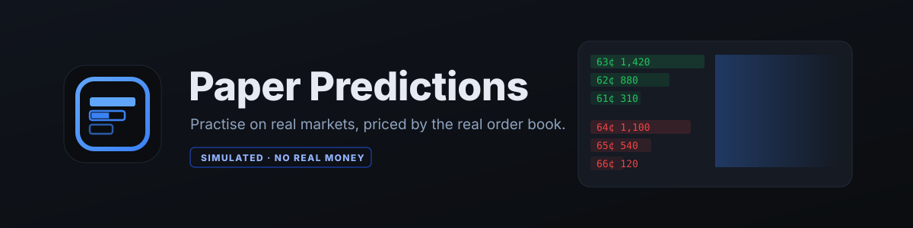

<p align="center">
  
</p>

<p align="center">
  <a href="../../releases/latest"></a>
  <a href="../../actions/workflows/ci.yml"></a>
  
  
  
</p>

**Paper Predictions** is a Chrome extension that puts a paper-trading panel on
top of real prediction markets. A panel appears on the market page you are
already reading; you pick a side, set a size, and place an order with simulated
money.

Every fill is priced by **walking the venue's actual live order book** — real
depth, real fees, a real latency penalty — so a thin market gives you a
genuinely bad average fill. That is the lesson, and it is the whole product.

Then it scores you on something P&L can't measure: a **Brier Skill Score against
the market's own price**. Did the forecast you paid for beat the forecast the
market was already giving away for free?

> **No real money is involved anywhere, and there is no path to placing a real
> order.** You start with P$10,000 of simulated currency. No sign-up, no email,
> no wallet.

---

## Install

### Download (no build)

1. Grab the latest **[`paper-predictions-*.zip`](../../releases/latest)** and unzip it
2. Open `chrome://extensions`
3. Turn on **Developer mode** (top right)
4. **Load unpacked** → select the unzipped folder
5. Open a market on any supported venue — the panel appears bottom-left

### Build from source

```bash
npm install
npm run pack
```

That produces two things:

| | What it is | Use it for |
|---|---|---|
| `release/paper-predictions/` | a **folder**, ready to load | testing locally |
| `release/paper-predictions-<version>.zip` | the same files zipped | sharing, Web Store |

Point **Load unpacked** at the **folder**. It is already the right shape — no
unzipping, no picking the right level.

### If Chrome shows an error

Nearly every install failure is one of four things, and Chrome reports all of
them as the same unhelpful *"Manifest file is missing or unreadable"*:

| What you selected | Why it fails |
|---|---|
| the `.zip` file | Load unpacked takes a folder, never an archive |
| a folder *containing* the extension folder | `manifest.json` has to be directly inside what you pick |
| `apps/extension` | the source tree has no `manifest.json` **on purpose**, so it can't be loaded by mistake |
| a folder from a half-finished build | read the terminal output; there is no valid build to load |

The folder you pick must have `manifest.json` sitting **directly inside it**.
If you see `assets/`, `icons/`, `src/` and `manifest.json` when you open it,
that is the one.

> *"Could not load javascript 'src/content/index.js'"* means you picked the
> source folder rather than a built one. Run `npm run pack` and use
> `release/paper-predictions/`.

Click the toolbar icon for the dashboard: **Book** (earnings, positions),
**Watch**, **Record** (calibration + Readiness Check), **History**, **Settings**.

---

## Venues

| Venue | Where the panel appears | Instrument | Auth needed |
|---|---|---|---|
| **Polymarket** | `polymarket.com/event/…` | binary CLOB | none |
| **Kalshi** | `kalshi.com/markets/…` | binary CLOB | none |
| **Hyperliquid** | `app.hyperliquid.xyz/outcomes/…` | HIP-4 outcome contract | none |
| **Limitless** | `limitless.exchange/markets/…` | binary CLOB on Base | none |

Adding a venue is one adapter file plus one line in the registry — nothing
venue-specific leaks past `packages/venues`.

A venue only ships if the instrument is a **binary outcome contract**, its book
is readable **without authentication**, and it exposes **depth, not just a last
price**. That last bar is why memecoin terminals are absent: a perp has
leverage, funding and liquidation and never settles to $1/$0, so supporting one
means a second fill engine — which is exactly how a simulator's numbers stop
meaning anything. [`docs/VENUE_RESEARCH.md`](docs/VENUE_RESEARCH.md) has the
venue-by-venue verdict, including what is blocked rather than missing.

---

## The fill engine — four rules

1. **Never fill beyond visible depth.** 500 on the book, you asked for 2,000 →
   you get 500, marked `partial`. No synthesized liquidity.
2. **Cap an order at 5% of visible depth.** *"Larger than this market can absorb
   — in reality you'd move the price against yourself."* This kills the main
   leaderboard exploit: dumping a bankroll into a 1-share book.
3. **Replay latency.** Your order does **not** fill against the book you quoted
   from. Realistic waits 250 ms (Brutal: 750 ms), fetches a *new* book, fills
   against that, and rejects with `price_moved` if the price ran >2% against you.
   Your quote is not your fill.
4. **No market impact modelling — and Settings says so.** Paper orders never
   touch the real book. Rule 2 keeps sizes small enough that this stays honest.

Plus a **resolution front-running lockout**: once a book is ≥97¢ / ≤3¢ with a
spread under 2¢, the outcome is already public and trading it is collecting, not
forecasting. Frozen.

| Mode | Price | Fees | Latency | Scores? |
|---|---|---|---|---|
| Instant | book mid | none | 0 ms | no — tutorial only |
| **Realistic** | walk the book | venue model | 250 ms | yes |
| Brutal | +1 tick adverse | 1.5× | 750 ms | yes |

**One fill engine, not two.** `packages/core` is imported by the extension *and*
bundled into the Edge Functions. A simulator that quotes with one engine and
fills with another is how you get a leaderboard nobody trusts.

---

## Statistical honesty is a feature

- **No Brier Skill Score below n=30.** It shows `18/30` instead. A skill score
  before 30 resolved positions is noise.
- **Always a confidence interval**, labelled approximate.
- **Categories under n=20 are greyed out** as thin, not presented as findings.
- **Instant-mode trades and voided markets never score.** A void is not a
  forecast you got wrong.
- **The Readiness Check** (unlocks at 100 resolved positions) will tell you
  plainly not to fund a real account if your score is negative — and refuses to
  call a positive score "proven" while its confidence interval still includes
  zero.

---

## Architecture

```
├── apps/extension/       MV3: service worker, on-page panel, dashboard
├── packages/core/        THE fill engine + scoring + coaching. Pure, 99% covered.
├── packages/venues/      VenueAdapter + polymarket · kalshi · hyperliquid · limitless
├── docs/                 venue research, API notes, security backlog
├── supabase/migrations/  forward-only SQL (leaderboard path)
└── supabase/functions/   quote · order-submit · portfolio · settle · bootstrap
```

A leaderboard is worthless if the client can name its own fill price. An app is
annoying if it demands an account from someone who just wants to practise. Those
pull in opposite directions, so the split falls where the line naturally is:

| | Solo play (default) | Leaderboard (opt-in) |
|---|---|---|
| Sign-up | none | anonymous handle, still no email |
| Fills priced | in the extension | Supabase Edge Function |
| State | `chrome.storage.local` | Postgres, RLS deny-all to clients |
| Network to our backend | **zero** | per order |
| User can edit their results | yes — it's their machine | no |

### The panel polls once a second and costs one request

A binary market is two tokens, and the panel needs a book twice per tick — once
to paint the price, once to price the ticket. Done naively that is four venue
requests a second against a CLOB budget that tightens near a hundred a minute,
and the 429s it earns are invisible: a rate-limited poll and a working poll that
found no change look identical on screen, so prices just quietly stop moving.

Now the book is fetched in **one batched request**, shared across everything
that asks for it inside the same tick, and de-duplicated while in flight. The
path that commits a fill deliberately bypasses that cache, because rule 3 says
the fill walks a book fetched *after* the quote. There is a live test that
counts real network calls and asserts the number is one.

When the feed does stall, the panel now says so and dims rather than showing a
stale number forever.

---

## Three bugs that would have silently corrupted every price

All found by testing against live data; all now asserted on every snapshot.

**1. Every venue returns books worst-first.** Polymarket's `bids` *ascend* to
the best bid at the END of the array; `asks` *descend* to the best ask at the
end. Kalshi does the same. Read either as best-first and a buy that should fill
at 13¢ fills at 15¢. The adapters sort explicitly rather than reversing, so a
future ordering change cannot quietly invert every book.

**2. Kalshi's orderbook has no asks at all.** The response is
`{orderbook_fp: {yes_dollars, no_dollars}}` — **bid ladders only**, each level
`["0.1500", "100.00"]`: element 0 is a price in *dollars as a string*, element 1
is a *contract count*, not a price. Both ask ladders must be synthesized by
mirroring — a YES bid at 7¢ **is** a NO ask at 93¢, same size.

**3. Hyperliquid's asset id is not the outcome number.** `l2Book` rejects the
outcome number, a ticker and `@index` alike, and returns `null` rather than an
error — so a wrong guess renders as an empty market, not a bug. The real
convention is `#{outcome}{side}`, discoverable only through `allMids`, and it is
string concatenation rather than arithmetic: outcome 1026 is `#10260`, not
`#10252`.

The mirror is checked on every book, and a book that fails it is refused rather
than quoted from:

```
best_yes_ask == 100 − best_no_bid
best_no_ask  == 100 − best_yes_bid
```

**Verified live on 100 markets per venue: 0 violations, 0 sort failures.** On
Kalshi the synthesized asks matched the venue's own quoted `yes_ask`/`no_ask`
exactly on all 100.

Where a mirror is *constructed by us* rather than quoted by the venue — Kalshi's
asks, Limitless's entire NO ladder — that check proves only that we can
subtract, and the code says so. The evidence there comes from outside the book:
the venue's own published midpoint, which the tests compare against.

---

## Testing

```bash
npm run verify      # secrets scan → typecheck → tests → build, all workspaces
npm run invariants  # live venue contract tests (LIVE=1)
```

| Suite | Covers |
|---|---|
| `packages/core` | 127 tests, **99.5% lines / 100% functions**, gate enforced at 90%. Property tests assert avg price always lies between the levels touched, cost always equals Σ(qty×price), and fills never exceed visible depth. |
| `packages/venues` | 38 tests: Kalshi mirror synthesis, Polymarket ordering, Hyperliquid coin ids, Limitless scaling — against books captured from live APIs. |
| `apps/extension` | 41 tests over the local engine: closed market, expired quote, replayed quote, depth cap, funds, 20% position cap, price-moved, weighted-average realized P&L. Plus URL parsing for every venue, and a `LIVE=1` suite that drives a real URL end to end into a priced ticket. |

Live-network suites are gated behind `LIVE=1` so a CI runner without outbound
access reports a skip rather than a false failure. They run nightly.

The build refuses to emit a `dist/` Chrome would reject: it fails if the content
script contains an `import` (classic scripts can't have one), if a `chrome.*`
namespace is used without its permission, if the manifest points at a missing
file, or if anything resembling a secret reaches a bundle.

---

## Privacy

Solo play sends **nothing** anywhere. No account exists for you. Market data is
fetched directly from the venues' public APIs by the extension's service worker;
your trades never leave `chrome.storage.local`.

Opting into the leaderboard creates an anonymous handle — no email, no password.
Identity is a random device key that stays on your machine; the server stores
only its SHA-256, and IP addresses are salted-hashed for rate limiting, never
stored raw.

## Compliance

- No control anywhere places, prefills, or deep-links a real order
- No cash prizes, ever — cosmetic only
- No affiliate or referral links to the venues
- A non-dismissible `SIMULATED · NO REAL MONEY` badge on every surface showing a
  price, position, or order
- No remotely-hosted code; everything ships in the bundle

> **Why not "Polybet"?** The Chrome Web Store bans extensions that facilitate
> real-money prediction market trading, and carves out an exception only for
> simulators that clearly indicate no real money is involved. Putting "bet" in
> the name argues against that exception in the first place a reviewer looks.

## Licence

MIT.
